# Medallion Architecture — E-commerce (Olist)

Pipeline de dades de mostra (Bronze → Silver → Gold) construït amb **dbt +
DuckDB**, com a exercici pràctic de l'arquitectura Medallion i com a peça de
portfolio. Fet a partir de dades públiques d'e-commerce (retail), sense cap
relació amb dades reals de feina.

## Per què aquest projecte

Rèplica en petit i amb dades obertes de l'arquitectura de tres capes
(Landing/Staging → Semàntica → Dominis) documentada al meu segon cervell
personal — el mateix patró que s'anomena Bronze/Silver/Gold a la indústria
i que cobreixen les certificacions Microsoft Fabric DP-600/DP-700.

| Vocabulari propi (hospital) | Vocabulari indústria | Aquest repo |
|---|---|---|
| Landing + Staging | Bronze | `models/bronze/` |
| Capa Semàntica | Silver | `models/silver/` |
| Dominis / Productes de dades | Gold | `models/gold/` |
| Visualització | Consum | Power BI (`power-bi/`) |

## Arquitectura

```mermaid
flowchart LR
    subgraph Fonts["Fonts (CSV Olist)"]
        A1[customers]
        A2[orders]
        A3[order_items]
        A4[products]
        A5[sellers]
        A6[payments]
        A7[reviews]
        A8[geolocation]
    end

    subgraph Bronze["🥉 Bronze — Landing/Staging"]
        B[stg_*.sql]
    end

    subgraph Silver["🥈 Silver — Capa Semàntica"]
        S[dim_* / fct_*.sql]
    end

    subgraph Gold["🥇 Gold — Dominis"]
        G1[mart_sales]
        G2[mart_customer_experience]
        G3[mart_logistics]
    end

    Fonts --> Bronze --> Silver --> Gold --> PowerBI[📊 Power BI]
```



## Dataset

[Brazilian E-Commerce Public Dataset by Olist](https://www.kaggle.com/datasets/olistbr/brazilian-ecommerce)
(Kaggle, llicència CC BY-NC-SA 4.0). ~100k comandes reals anonimitzades
d'un marketplace brasiler, repartides en 9 CSVs — simula bé un escenari de
"múltiples sistemes font" (clients, comandes, pagaments, logística,
reviews) sobre el qual té sentit aplicar landing/staging per origen.

**No es distribueixen les dades cru en aquest repo** (mida i llicència).
Per reproduir:

1. Descarrega el dataset de Kaggle (cal compte gratuït).
2. Descomprimeix els CSVs dins `data/raw/`.

## Setup

```bash
python -m venv .venv
.venv\Scripts\activate          # Windows
pip install -r requirements.txt

cp profiles.yml.example profiles.yml   # ajusta el path si cal
dbt debug
dbt build
```

## Pla de treball (fases)

- [ ] **Fase 0 — Setup** (fet): esquelet del projecte, dbt + DuckDB instal·lats, repo Git inicialitzat.
- [ ] **Fase 1 — Bronze**: descarregar dataset, declarar `sources.yml`, escriure els `stg_*.sql` (normalització mínima, sense lògica de negoci).
- [ ] **Fase 2 — Silver**: model semàntic (`dim_*`/`fct_*`), joins i regles de negoci, primers tests dbt (`not_null`, `unique`, `relationships`).
- [ ] **Fase 3 — Gold**: 3 data marts de domini (`mart_sales`, `mart_customer_experience`, `mart_logistics`).
- [ ] **Fase 4 — Consum**: dashboard Power BI connectat a Gold, captures a `power-bi/`.
- [ ] **Fase 5 — Polish**: `dbt docs generate`, README final, opcional CI amb GitHub Actions (`dbt build` en cada push).
- [ ] **Fase 6 — Publicació**: repo públic a GitHub, enllaçat des del portfolio.

## Estat

🚧 En construcció — Fase 1 en curs.
