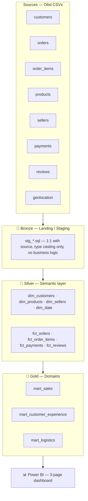
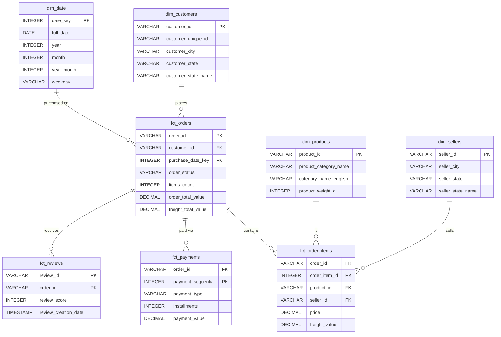
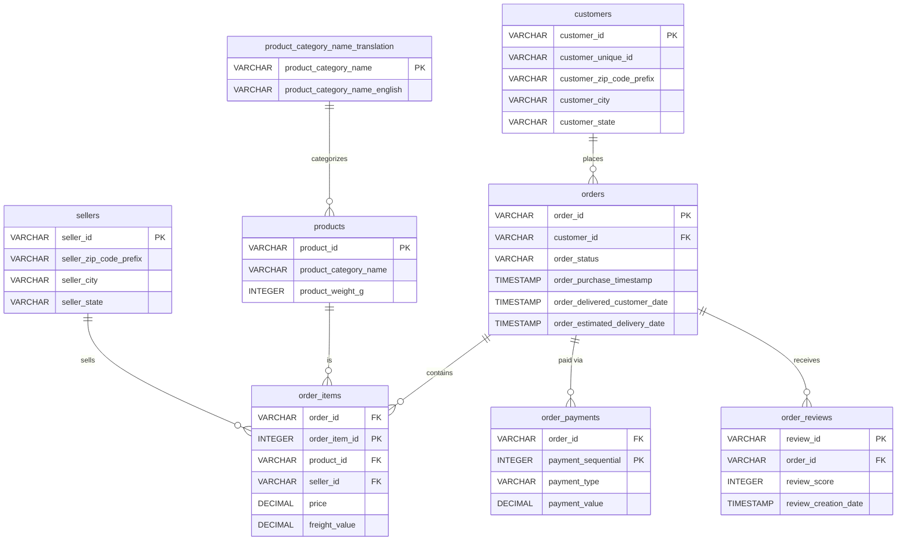

# Medallion Architecture — E-commerce (Olist)

Sample data pipeline (Bronze → Silver → Gold) built with **dbt + DuckDB**,
as a hands-on exercise in the Medallion architecture and as a portfolio
piece. Built on public e-commerce (retail) data, unrelated to any
employer's real data.

## Why this project

A small-scale replica, with open data, of the classic three-layer pattern
(Landing/Staging → Semantic → Domains) — known in the industry as
Bronze/Silver/Gold, and covered by the Microsoft Fabric DP-600/DP-700
certifications.

| Industry vocabulary | This repo |
|---|---|
| Bronze (Landing/Staging) | `models/bronze/` |
| Silver (Semantic layer) | `models/silver/` |
| Gold (Domains / data products) | `models/gold/` |
| Consumption | Power BI (`power-bi/`) |

## Architecture



## Data model (Silver layer)

A star schema (technically a fact constellation: four fact tables sharing
conformed dimensions), designed grain-first before writing any SQL:

- `fct_orders` — one row per order (an **accumulating snapshot fact**: the
  row fills in as the order moves through purchase → approval → carrier →
  delivery).
- `fct_order_items` — one row per order item.
- `fct_payments` — one row per payment (an order can have more than one).
- `fct_reviews` — one row per **(review_id, order_id)**, not review_id
  alone. Discovered during testing: `review_id` isn't globally unique (it
  can repeat across different orders), and an order can legitimately get
  more than one review. The initial design assumed a simple grain; the
  data disagreed, so the model and its tests were corrected to match
  reality instead of silencing the failing test.

All four share the same conformed dimensions (`dim_customers`,
`dim_products`, `dim_sellers`, `dim_date`), so metrics from different
facts stay comparable under the same filters in Power BI.
`dim_customers`/`dim_sellers` are enriched with full Brazilian state
names (`br_state_names` seed) — Olist only provides 2-letter codes, and
sellers have no published business name at all (deliberately
anonymized), so state + city is the closest real, non-fabricated
identifying context available.

**Keys**: natural keys are kept for `dim_customers`/`dim_products`/
`dim_sellers` — this is a single source system with already-unique, stable
IDs, so a surrogate key would add overhead without solving a real problem.
`dim_date` is the one exception: it always gets an integer surrogate key
(`date_key`, e.g. `20180724`), the universal convention that makes Power
BI/DAX time intelligence (`SAMEPERIODLASTYEAR`, etc.) work without
friction.

**No SCD2**: this dataset is a static historical snapshot, not a
continuously refreshed pipeline, so Slowly Changing Dimension history
tracking would be engineering for a problem we don't have. `dim_customers`
would be the natural SCD2 candidate if this ever became a live pipeline.

**Referential integrity**: DuckDB (like most analytical engines) doesn't
enforce foreign keys. 45 dbt tests (`not_null`, `unique`, `relationships`,
plus 3 custom grain-uniqueness tests) are the real substitute — see
`models/silver/schema.yml` and `tests/`.



## Data model (Gold layer)

Three denormalized, business-facing marts, one per domain — flat tables
ready for direct Power BI consumption without needing to rebuild
star-schema relationships. Grain and shared calculation logic:

| Mart | Grain | Focus |
|---|---|---|
| `mart_sales` | one row per order item | revenue by date/category/seller/customer state |
| `mart_customer_experience` | one row per (review_id, order_id) | review scores vs. delivery timing |
| `mart_logistics` | one row per order item | shipping performance by seller |

`delivery_days`/`delay_days`/`is_late` are computed identically in
`mart_customer_experience` and `mart_logistics` (same question, two
audiences: satisfaction vs. operations) — rather than duplicate the SQL,
the calculation lives in one place: the `days_between()` macro
(`macros/days_between.sql`).

The data backs this up with a real finding: average review score is
**4.29 for on-time deliveries vs. 2.27 for late ones** (and 1.76 for
orders reviewed before delivery even completed) — a concrete, queryable
answer to "does shipping performance affect customer satisfaction?".

## Key findings

Things the data itself surfaced while building this, not decided upfront:

- **Late delivery correlates strongly with dissatisfaction**: 4.29 vs.
  2.27 average review score, on-time vs. late (`mart_customer_experience`).
- **`fct_reviews`'s real grain is `(review_id, order_id)`, not `review_id`
  alone** — a `unique` test failure (789 duplicate groups) caught that
  `review_id` isn't globally unique and some orders get more than one
  review. Fixed in the model and documented, not silenced.
- **A "worst sellers by delay" leaderboard is misleading without a volume
  floor**: the top-ranked sellers by average delay each had exactly one
  late delivery — an outlier of n=1, not a pattern. Fixed with a
  `Late Deliveries Count >= 5` filter (see `power-bi/README.md`).
- **The last ~5 weeks of data (late Aug–early Sept 2018) taper off to
  near-zero** — daily order volume declines smoothly for about 10 days
  before stopping abruptly, consistent with the Olist dataset's known
  data-collection cutoff rather than a real business event. Not excluded
  from the dashboard by choice; worth knowing if the trend chart's tail
  looks like a cliff.

## Dataset

[Brazilian E-Commerce Public Dataset by Olist](https://www.kaggle.com/datasets/olistbr/brazilian-ecommerce)
(Kaggle, CC BY-NC-SA 4.0 license). ~100k anonymized real orders from a
Brazilian marketplace, split across 9 CSVs — a realistic stand-in for a
"multiple source systems" scenario (customers, orders, payments,
logistics, reviews), which makes landing/staging per source meaningful.

The raw schema, before any transformation (this is the "before" picture —
see the Silver ER diagram above for the "after"):



`geolocation` (zip code → lat/lng) isn't shown: it's a standalone lookup
joined loosely by zip code prefix, not a true foreign key relationship
like the others.

**Raw data is not distributed in this repo** (size and license). To
reproduce:

1. Download the dataset from Kaggle (free account required).
2. Unzip the CSVs into `data/raw/`.

## Setup

```powershell
git clone https://github.com/deexposito/medallion-ecommerce.git
cd medallion-ecommerce

python -m venv .venv
.venv\Scripts\Activate.ps1      # Windows PowerShell; use .venv\Scripts\activate.bat for cmd.exe
pip install -r requirements.txt

cp profiles.yml.example profiles.yml   # adjust the path if needed

# dbt looks for profiles.yml in ~/.dbt by default, not the project folder -
# point it here instead (needed for every dbt command in this project)
$env:DBT_PROFILES_DIR = "."

dbt debug
dbt build

# hand off the Gold marts (+ dim_date) to Power BI (see power-bi/README.md)
python scripts\export_gold_to_parquet.py
```

If `Activate.ps1` is blocked by PowerShell's execution policy, skip
activation and call the venv's executables directly instead (same
effect): `.venv\Scripts\dbt.exe build`,
`.venv\Scripts\python.exe scripts\export_gold_to_parquet.py`.

## Documentation

`dbt docs generate && dbt docs serve` builds and opens an interactive
site with every model's description, columns, tests, and — the most
useful part — the full Bronze → Silver → Gold lineage graph. Not
committed (generated into the gitignored `target/`); regenerate anytime.

## Continuous integration

`.github/workflows/dbt_ci.yml` runs `dbt parse` on every push and pull
request — validates the whole project (refs, Jinja, `schema.yml`)
without needing the dataset. Deliberately not a full `dbt build`; see
`docs/decisions/0002-lightweight-ci.md` for why.

## Build phases

- **Phase 0 — Setup**: project skeleton, dbt + DuckDB installed, Git repo initialized.
- **Phase 1 — Bronze**: dataset downloaded, `sources.yml` (8 tables via `external_location`) + 1 `dbt seed` (small reference table), 9 `stg_*.sql` models. Decision documented in `docs/decisions/0001-seeds-vs-external-sources.md`.
- **Phase 2 — Silver**: dimensional model (4 `dim_*` + 4 `fct_*`), 45 dbt tests (`not_null`, `unique`, `relationships` + 3 custom grain tests). Fixed a real data-quality finding (`fct_reviews` composite grain) discovered by the tests.
- **Phase 3 — Gold**: 3 denormalized domain marts (`mart_sales`, `mart_customer_experience`, `mart_logistics`), shared delivery-timing logic factored into a macro. 57 dbt tests passing.
- **Phase 4 — Consumption**: 3-page Power BI dashboard (Sales, Customer Experience, Logistics) connected to the 3 Gold marts + shared `dim_date` calendar table. Built by hand in Power BI Desktop per `power-bi/README.md`.
- **Phase 5 — Polish**: `dbt docs generate` (lineage graph), lightweight CI (`dbt parse` — `docs/decisions/0002-lightweight-ci.md`).
- **Phase 6 — Publish**: public GitHub repo, CI passing on GitHub Actions.
